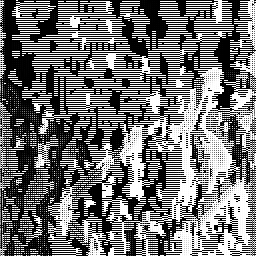

# RISC-V Canny Edge Detection Pipeline 🚀


A C++ implementation of the Canny Edge Detection pipeline with scalar and RISC-V Vector (RVV) code paths. The project targets RV64GC/RV64GCV builds and uses QEMU user-mode emulation for functional verification.

## Features

- Complete Canny pipeline:
  Gaussian Blur, Sobel Gradients, Magnitude, Direction Quantization, Non-Maximum Suppression, Double Thresholding, and Hysteresis.
- Native host scalar build for development and unit testing.
- RISC-V scalar build using `rv64gc`.
- RISC-V RVV build using `rv64gcv`.
- RVV implementations for Gaussian Blur, Sobel, Magnitude, Direction, and NMS.
- Bit-exact verification between RISC-V scalar output and RISC-V RVV output.
- GoogleTest test suite with 34 passing tests.

## Repository Structure

```text
.
|-- assets/
|   `-- final_edges.png       # Example edge-detection output
|-- docs/
|   `-- RISCV_Canny_Documentation_v4.pdf
|-- images/                   # Automated pipeline verification assets
|   |-- raw/                  # Pure 8-bit raw pixel dumps per stage
|   `-- png/                  # Viewable converted PNG artifacts
|-- include/                  # Pipeline headers
|   |-- gaussian.h            # Gaussian Blur, scalar + RVV
|   |-- sobel.h               # Sobel Gradients, scalar + RVV
|   |-- magnitude.h           # Gradient Magnitude, scalar + RVV
|   |-- direction.h           # Direction Quantization, scalar + RVV
|   |-- nms.h                 # Non-Maximum Suppression, scalar + RVV
|   |-- threshold.h           # Double Thresholding
|   |-- hysteresis.h          # Hysteresis Edge Tracing
|   `-- image_io.h            # Raw image I/O interface
|-- src/
|   |-- main.cpp              # Pipeline entry point and timing harness
|   |-- image_io.cpp          # Raw image load/save implementation
|   `-- generate.cpp          # Optional one-shot output generator
|-- tests/
|   `-- test_pipeline.cpp     # GoogleTest unit and integration tests
|-- tools/                    # Utility scripts
|   |-- fix_image.py          # Image preprocessing utility
|   `-- view.py               # Visualize raw output
|-- Makefile                  # Host, RISC-V scalar, and RISC-V RVV targets
|-- input.raw                 # 256x256 grayscale test image
|-- LICENSE
|-- .gitignore
`-- README.md

## Prerequisites

Install the following tools on Linux/WSL:

```bash
sudo apt update
sudo apt install -y g++ qemu-user g++-riscv64-linux-gnu libgtest-dev
```

Required commands:

- `g++`
- `riscv64-linux-gnu-g++`
- `qemu-riscv64`
- GoogleTest libraries: `-lgtest -lgtest_main`

The project guide recommends a custom RVV-capable RISC-V GNU toolchain built with `--with-arch=rv64gcv`. This repository uses the Linux user-mode QEMU flow, so `RV_CXX` defaults to `riscv64-linux-gnu-g++`. If the system package does not provide `<riscv_vector.h>` or cannot compile `-march=rv64gcv`, point `RV_CXX` to a custom RVV-capable compiler.

## Build And Run

Run the host unit tests:

```bash
make test
```

Build all binaries:

```bash
make all
```

Run the native host scalar version:

```bash
make host
./host_canny 256 256 100
```

Run the RISC-V scalar binary under QEMU:

```bash
make run_scalar ARGS="256 256 100"
```

Run the RISC-V RVV binary under QEMU:

```bash
make run_rvv ARGS="256 256 100"
```
---

## 🖼️ Pipeline Visual Verification

The profiling harness isolates and outputs visual artifacts for each core mathematical stage of the Canny edge detection pipeline. Below is the sequential progression from the raw source data to the finalized edge map:

### 1. Pre-Processing & Gradient Extraction
| 01. Gaussian Blur | 02. Sobel Gradients (X / Y) | 03. Gradient Magnitude |
| :---: | :---: | :---: |
|  |  |  |
| *Removes high-frequency noise.* | *Extracts spatial derivatives.* | *Maps total edge strength.* |

### 2. Edge Thinning & Final Suppression
| 04. Non-Maximum Suppression | 05. Double Thresholding | 06. Hysteresis (Final Output) |
| :---: | :---: | :---: |
|  |  |  |
| *Thins edges to 1-pixel lines.* | *Categorizes edge candidates.* | *Traces and cleans final edges.* |

---

## Correctness Verification

The main correctness check compares the RISC-V scalar output against the RISC-V RVV output using the same QEMU CPU configuration:

```bash
make verify
```

Expected result:

- `cmp scalar_output.raw rvv_output.raw` prints no differences.
- `sha256sum scalar_output.raw rvv_output.raw` prints the same hash for both files.

Latest verified result:

```text
[  PASSED  ] 34 tests.

RISC-V Scalar SHA-256:
502e32bd63ca1f3a446055085d2c916f7979516924d40fa943ad8046f24ece8f

RISC-V RVV SHA-256:
502e32bd63ca1f3a446055085d2c916f7979516924d40fa943ad8046f24ece8f
```

This confirms that the RVV implementation is functionally correct and produces byte-identical final edge output compared with the RISC-V scalar implementation.

VLEN sweep commands:

```bash
make verify VLEN=128
make verify VLEN=256
make verify VLEN=512
```

These runs use QEMU's `vlen=<N>` CPU option. Matching output at all three VLEN values demonstrates that the RVV loops are vector-length agnostic.

Latest VLEN sweep result:

| VLEN | Result | SHA-256 |
|------|--------|---------|
| 128 | Scalar and RVV outputs matched | `502e32bd63ca1f3a446055085d2c916f7979516924d40fa943ad8046f24ece8f` |
| 256 | Scalar and RVV outputs matched | `502e32bd63ca1f3a446055085d2c916f7979516924d40fa943ad8046f24ece8f` |
| 512 | Scalar and RVV outputs matched | `502e32bd63ca1f3a446055085d2c916f7979516924d40fa943ad8046f24ece8f` |

## Final Results To Report

The main validated results are:

| Item | Result |
|------|--------|
| Unit tests | 34/34 passed |
| Host build | Passed |
| RISC-V scalar build | Passed |
| RISC-V RVV build | Passed |
| Scalar vs RVV output comparison | Byte-identical |
| SHA-256 comparison | Matching hashes |
| Performance environment | QEMU user-mode emulation |

The most important correctness evidence is:

```text
cmp scalar_output.raw rvv_output.raw
```

This command produced no output, which means the two files are identical.

The SHA-256 hashes were also identical:

```text
502e32bd63ca1f3a446055085d2c916f7979516924d40fa943ad8046f24ece8f  scalar_output.raw
502e32bd63ca1f3a446055085d2c916f7979516924d40fa943ad8046f24ece8f  rvv_output.raw
```

## Benchmarking

Run:

```bash
make benchmark ARGS="256 256 100"
```

Latest QEMU benchmark using a 256x256 image and 100 iterations:

### RISC-V Scalar

```text
Mode:            RISC-V Scalar
Size:            256x256
Iterations:      100
Gaussian Blur:   38.11% (136.88 ms)
Sobel Gradients: 13.56% (48.71 ms)
Magnitude:       7.57% (27.19 ms)
Direction:       11.34% (40.75 ms)
NMS:             12.98% (46.63 ms)
Thresholding:    6.17% (22.17 ms)
Hysteresis:      10.26% (36.87 ms)
Total Time:      359.20 ms
```

### RISC-V RVV

```text
Mode:            RISC-V RVV
Size:            256x256
Iterations:      100
Gaussian Blur:   46.63% (1095.64 ms)
Sobel Gradients: 15.44% (362.72 ms)
Magnitude:       8.59% (201.92 ms)
Direction:       12.11% (284.65 ms)
NMS:             14.58% (342.63 ms)
Thresholding:    0.97% (22.70 ms)
Hysteresis:      1.68% (39.43 ms)
Total Time:      2349.70 ms
```

## Important Note About QEMU Timing

QEMU user-mode emulation is useful for validating that the RISC-V scalar and RVV binaries run correctly and produce matching output. However, QEMU emulates RVV instructions in software, so the wall-clock runtime is not a reliable measurement of real RVV hardware performance.

For this reason, the QEMU benchmark should be reported as an emulation result only. The strongest validated result in this project is correctness: the RVV binary produces byte-identical output compared with the RISC-V scalar binary.

Accurate RVV performance evaluation requires real RVV-capable hardware or a simulator/tooling setup intended for performance measurement.

## Reproducibility Commands

Use this exact sequence to reproduce the final validation:

```bash
make clean
make test
make verify VLEN=128
make verify VLEN=256
make verify VLEN=512
make benchmark ARGS="256 256 100"
```

Expected validation result:

- `make test` should finish with `34 tests` passed.
- each `make verify VLEN=<N>` command should build both RISC-V binaries.
- `cmp scalar_output.raw rvv_output.raw` should print nothing.
- `sha256sum scalar_output.raw rvv_output.raw` should print matching hashes.
- `make benchmark` should print two profiles: `RISC-V Scalar` and `RISC-V RVV`.

Do not use native host timing as a direct comparison against QEMU RISC-V timing. Host timing runs on the x86 machine, while RISC-V timing runs inside emulation.

## Implementation Notes

- Gaussian Blur uses zero-padding at the image boundary, matching the project guide.
- Border handling in the RVV Gaussian and Sobel kernels was matched to the scalar implementation.
- The RVV Sobel `Gy` sign was corrected to match the scalar Sobel-Y kernel.
- Gaussian normalization uses exact division by 273 in the RVV path to preserve scalar-equivalent output.
- RVV code is guarded with `__riscv_vector`, so scalar RISC-V builds do not require RVV intrinsics.
- The main program validates command-line arguments and reports the active mode:
  `Host Scalar`, `RISC-V Scalar`, or `RISC-V RVV`.
- Raw image I/O checks file read/write failures instead of silently continuing.
- `src/generate.cpp` is optional and can compile without RVV because it falls back to the scalar direction kernel when `__riscv_vector` is not enabled.

## Clean Generated Files

```bash
make clean
```

Generated output files such as `output.raw`, `scalar_output.raw`, and `rvv_output.raw` can also be removed manually if needed.

## Report Summary

```text
The project implements a full Canny Edge Detection pipeline in C++ with scalar and RISC-V Vector code paths. Gaussian Blur uses zero-padding at image boundaries, matching the project guide. The implementation was tested using 34 GoogleTest tests, all of which passed. The RISC-V scalar and RVV binaries were executed under QEMU at VLEN=128, VLEN=256, and VLEN=512. For all three VLEN values, the final output files were compared with cmp and SHA-256, and both outputs were byte-identical.

The RVV version is slower than the scalar version under QEMU because QEMU emulates vector instructions in software. Therefore, the QEMU runtime is not used as evidence of real hardware speedup. It is used mainly to validate functional correctness of the RVV implementation.
```
